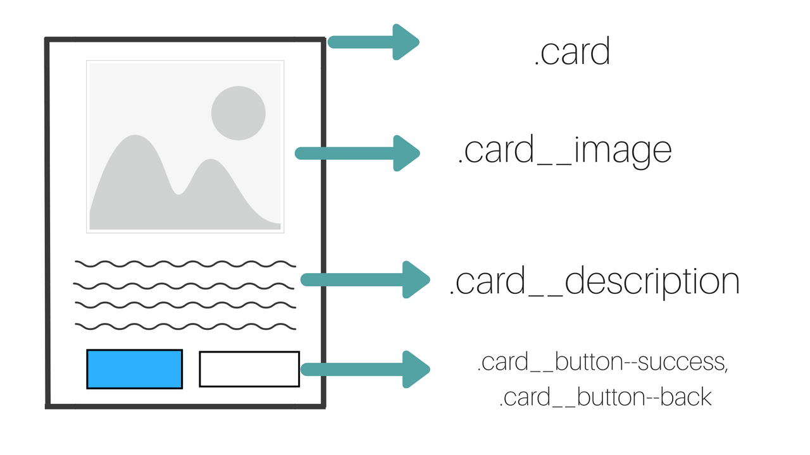
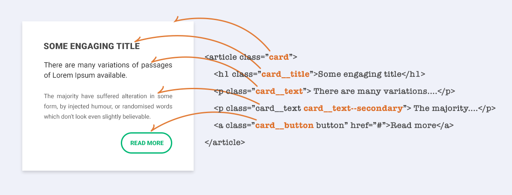
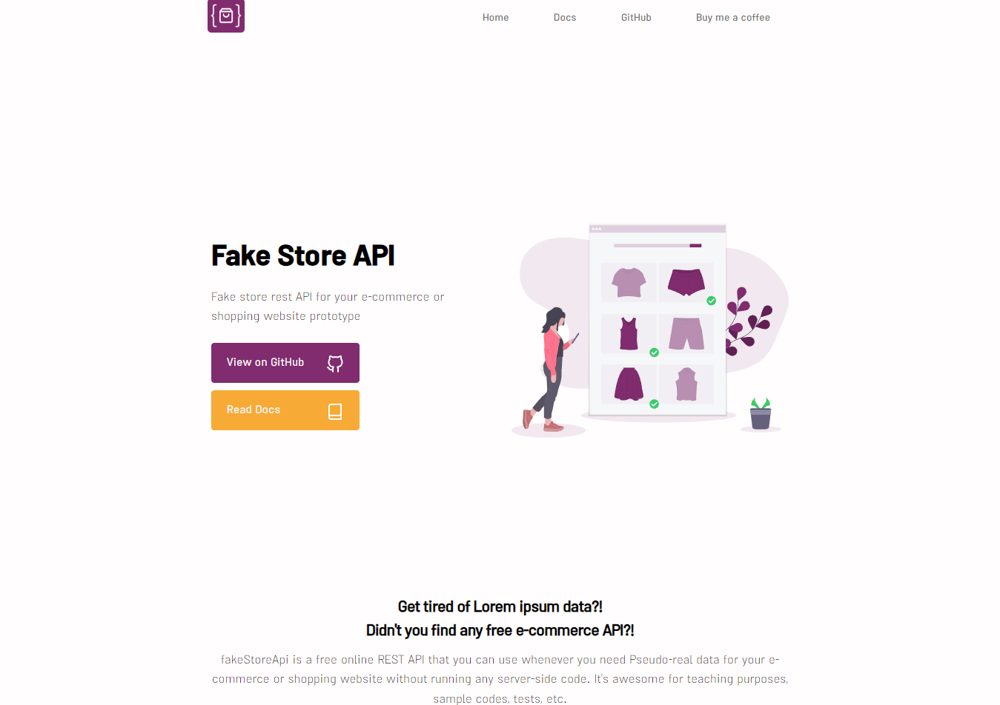

# Practicas Preprofesionales
## Proyecto: Consumo a una API => Landing Page => Vanilla JS
<h3 align="center">TOOLS</h3>
<p align="center">
  
  
  
  
</p>


#### Control de practicas preprofesionales

| Actidad | Tipo | Semana | Contenido | Estado |
| --- | --- | --- | --- | --- |
| Investigación | Ins | semana 1 | API | Completo |
| Maquetado | Prac | semana 2 | HTML | Completo |
| Diseño | Prac | semana 3 | CSS | Completo |
| Diseño | Prac | semana 4 | CSS, Responsive | Completo |
| Analisis API | Prac | semana 5 | JavaScript | Incompleto |
| Consumo API | Prac | semana 6 | JavaScript | Incompleto |
| Estructura API | Prac | semana 7 | JavaScript | Incompleto |
| Despleguie de Aplicacion | Prac | semana 8 | GitHub | Incompleto |

## Investigación

### ¿Qué es una API?
API significa "Application Programming Interface" que es una forma de comunicarse entre diferentes servicios de software.

Una API web o API de servicio web es un conjunto de herramientas que permite a los desarrolladores enviar y recibir instrucciones y datos entre un servidor web y un navegador web, generalmente en formato JSON, para crear aplicaciones.

### Códigos de Estado de Respuesta HTTP
- ` 400 Bad Request ` Esta respuesta significa que el servidor no pudo interpretar la solicitud dada una sintaxis inválida.

- ` 401 Unauthorized ` Es necesario autenticar para obtener la respuesta solicitada. Esta es similar a 403, pero en este caso, la autenticación es posible.

- ` 402 Payment Required ` Este código de respuesta está reservado para futuros usos. El objetivo inicial de crear este código fue para ser utilizado en sistemas digitales de pagos. Sin embargo, no está siendo usado actualmente.

- ` 403 Forbidden ` El cliente no posee los permisos necesarios para cierto contenido, por lo que el servidor está rechazando otorgar una respuesta apropiada.
- ` 404 Not Found ` El servidor no pudo encontrar el contenido solicitado. Este código de respuesta es uno de los más famosos dada su alta ocurrencia en la web. 


Node.js es una biblioteca y un entorno de tiempo de ejecución JavaScript multiplataforma de código abierto para ejecutar aplicaciones web fuera del navegador del cliente. Los desarrolladores usan Node.js para crear aplicaciones web del lado del servidor y es perfecto para aplicaciones con uso intensivo de datos, ya que usa un evento asíncrono.

A continuación algunas características importantes:

1. Node.js es realmente rápido: al haber sido creado en  el motor JavaScript V8 de Google Chrome  , su biblioteca es extremadamente rápida para la ejecución de código.
2. Node Package Manager (NPM): Node Package Manager tiene más de 50 000 paquetes, por lo que cualquier funcionalidad requerida para una aplicación se puede importar fácilmente desde NPM.
3. Node.js usa programación asíncrona: todas las API de la biblioteca de Node.js son asíncronas (es decir, no bloquean), por lo que un servidor basado en Node.js no espera a que la API devuelva datos. El servidor llama a la API y, en caso de que no se devuelvan datos, el servidor pasa a la siguiente API. El módulo de eventos de Node.js ayuda al servidor a obtener una respuesta de la llamada API anterior. Esto también ayuda con la velocidad de Node.js.
4. Sin almacenamiento en búfer: Node.js reduce drásticamente el tiempo de procesamiento al cargar archivos de audio y video. Las aplicaciones de Node.js nunca almacenan datos en el búfer y simplemente generan los datos en fragmentos.
5. Subproceso único: Node.js utiliza un modelo de subproceso único con bucle de eventos. Como resultado, puede brindar servicio a un número mucho mayor de solicitudes que los servidores tradicionales como Apache HTTP Server.
6. Altamente escalable: el servidor Node.js responde sin bloqueos, lo que lo hace altamente escalable en contraste con los servidores tradicionales, que crean subprocesos limitados para manejar las solicitudes.

### Métodos GET & POST

- #### GET
  - Se utiliza principalmente en el lado del cliente (navegador) para enviar una solicitud a un servidor específico para obtener ciertos datos o recursos. Usando este método, el servidor solo debería dejarnos recibir los datos y no cambiar su estado. Por lo tanto, solo se usa para ver algo y no para cambiarlo. El método Get es uno de los métodos HTTP más utilizados. El parámetro de solicitud del método get se agrega a la URL. Obtener solicitud es mejor para los datos que no necesitan ser seguros (es decir, los datos que no contienen imágenes o documentos de texto).
- #### POST
  - Se utiliza principalmente en el lado del cliente (navegador) para enviar datos a un servidor especificado con el fin de crear o reescribir un recurso/datos en particular. Estos datos enviados al servidor se almacenan en el cuerpo de la solicitud de la solicitud HTTP. El método de publicación eventualmente conduce a la creación de un nuevo recurso o a la actualización de uno existente. Debido a este uso dinámico, es uno de los métodos HTTP más utilizados. No es uno de los métodos más seguros porque los datos que se envían se incluyen en el cuerpo de la solicitud y no en la URL. La solicitud posterior es mejor para los datos que deben estar seguros (es decir, los datos que contienen imágenes o documentos).  
  
### Metodologías CSS: BEM (Bloque, Elemento Modificador)  
Las metodologías CSS son sistemas preestablecidos, formales y bien documentados que nos ayudan a escribir y organizar código CSS mantenible y escalable; para este proyecto en específico se hará uso de la metodología **BEM**.  



- #### Bloque:
  - Son nuestros contenedores más grandes que a su vez contienen elementos u otros bloques.
  
- #### Elementos: 
  - Forman parte de un bloque, normalmente son los botones, textos, imágenes etc.
  
- #### Modificadores:
  - Se usan para establecer estilos diferentes a un mismo bloque o elemento.  

  

  ```
  [bloque]__[elemento]
  [bloque]--[modificador]
  [elemento]--[modificador]
  [bloque]__[elemento]--[modificador]
  ```

### API - [Fake Store API](https://fakestoreapi.com/)
[](https://fakestoreapi.com/)  

#### ¿Cómo usar Fake Store API?
fakeStoreApi se puede usar con cualquier tipo de proyecto de compras que necesite productos, carritos y usuarios en formato JSON.  

- #### OBTENER TODOS LOS PRODUCTOS
  - ```js
    fetch('https://fakestoreapi.com/products')
            .then(res=>res.json())
            .then(json=>console.log(json))  
    ```
- #### OBTENER TODOS LOS PRODUCTOS
  - ```js
    fetch('https://fakestoreapi.com/products')
            .then(res=>res.json())
            .then(json=>console.log(json))  
    ```

### GIT
- Branch
- remote
- ssh key.gen
- pull
- push
- commit
- add .
- pull request

```JavaScript
let totalProjects = 1
```  
